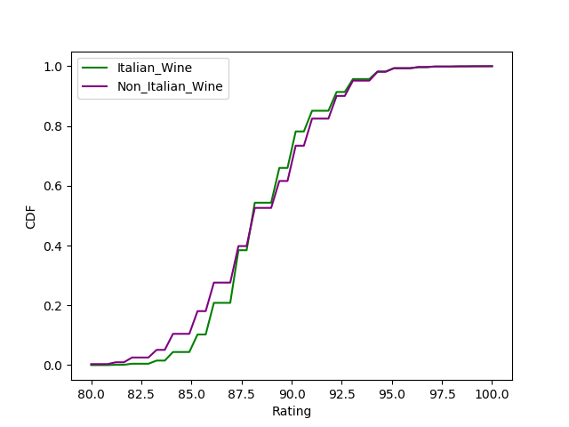
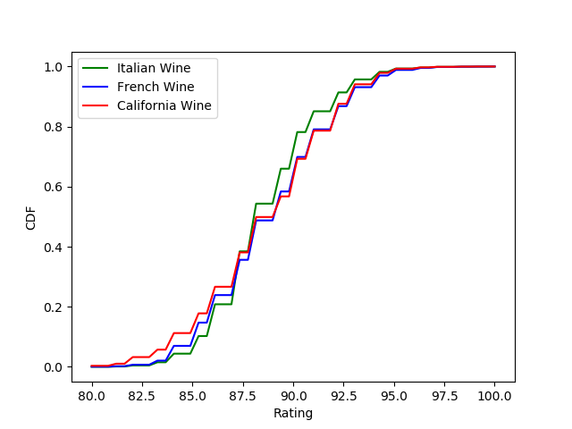

# wine_ratings

## Motivation
As a self-proclaimed Oenophile, analyzing the data collected by wine experts employed by WineEnthusist, allowed me to dive into the controversial subject of wine ratings. Ratings help guide consumers to spend their money on wine that has verified, quantified quality. This key advertising strategy has launched a series of tasting events, social media rating apps along with wine competitions. Wine consumption has been skyrocketing, and as such, exploring our built in assumptions is a key aspect to moving forward in the wine industry. 

## Questions
1. Do our tasters have a more lengthy description of the wines they have rated higher? 
2. Do specific regions or countries have statistically higher ratings?

## About this Data
* Viewing this data before manipulating the points of interest, it seems like there is a total of thirteen categories. 
    1. Country: This gives the full name of the Country where the wine was made.
    2. description: Here is the description given by the wine taster
    3. designation: Typically this indicates unusual qualities of the wine like color but can also count as a labeled reserve or special selection
    4. points: This refers to the rating given by the taster
    5. price: Price of wine at the moment it was tasted
    6. province: states, divisons or other special areas within a country where winery is located
    7. region_1: more specific area of winery than province
    8. region_2: the most specific geographical area provided 
    9. taster_name: Name of the taster, info about the individual can be found on WineEnthusiast.com
    10. taster_twitter_handle: taster's available social media
    11. title: the name of the wine
    12. variety: what variety or type classifies the wine
    13. winery: specific name of wine's original location

* With 43 different countries listed, I was interested in the amount of wines from each country were rated in this data set. Here is a visual of the top included countries and the least included. 

* Price seems to drive much of the wine business. Viewing the inital disribution of prices, most wines tasted were between $10 and $70. However, these tasters have also ventured into the outlandish prices including the most exensive bottle: $300,000. 

    * In the visual above we see the prices with the top five countrys all have substatial outliers, the most sigificant being France. 
    * We also see an overall price drop when compared to the rating above, at and below the average point value of the data set. 

* The collection of ratings does follow the expectation which was centering around the center option of 90 points. 

## Hypotheses

1.  My personal favorite wines are Italian based; I believe the raters would rate wines from Italy higher. 

    * Null Hypothesis: Italian wines have the same average rating as other countries
    * Alternative Hypothesis: Italian wines have a statistically significant higher rating. 

    Comparing Italian Wines to all others, I found a p-value of 0.0008348843726267126. 

2. Similarly, I was interested in looking at three of the most popular regions to compare ratings as well.  

    * Null Hypothesis: Italian, French and Californian wines have aproximate the same variation in rating. 
    * Alternative Hypothesis: Italian, French and Californian wines have varying ratings from eachother

In each hypothesis above, I calculated p_values dastically below my Initial significance level of 0.05. Since I looked at samples repeatedly, I also used the bonferonni correcion to be certain that I still had a vair significance level. 

    Italian Wines compared to French calculated a a p-value of 5.214538499785126e-23.
    Italian Wines compared to California wines determined a p-value of 4.78886549077239e-09.
    Finally, French wines and California wines have a calculated p-value of 1.4295597538415638e-07.

These all produce significant p_values that fall far below the alpha level chose. I can say that these wines do have statistically significant differences in their ratings when compared to regions like Italy, France and California. 

    * NOTE: The two images provided above each show a cumulative disribution function. The similarity between these disrtibutions does not support a concusion of having a practical difference in our wine ratings when comparing to region. 

3. Those rating the wines 

    * Null Hypothesis: Wines that are less than the median rating have a the same length descriptions as wines with points above the median.
    * Alternative Hypothesis: Wines that are higher than the median rating have longer descriptions than the wines with lower ratings.

    Once finding a p_value of exactly 0. I can certainly conclude that the rating value is connected to having longer descriptions.

    The visual above shows a clear connection between the rating and the length of the description as well as the drastic variations in description length. 

