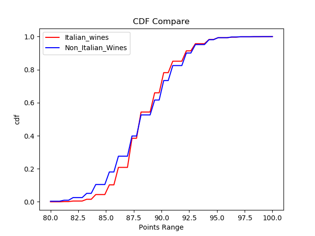
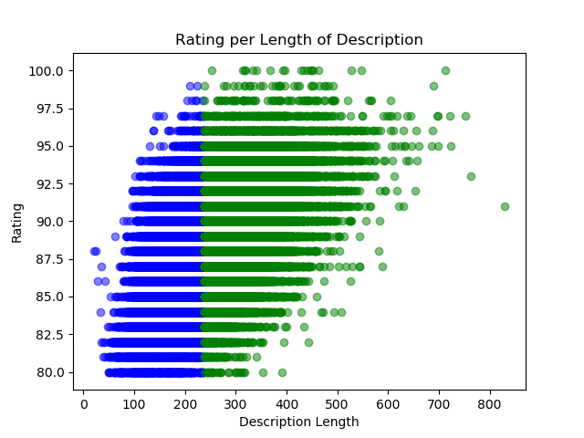

# wine_ratings

## OVERVIEW

History of wine ratings goes here: 
src to help: https://winefolly.com/tips/wine-ratings-explained/

## Questions
1. Is there actually statistical correlations between rating and description?

2. Which varieties are popuar in each individual region and does that popularity span to other regions?

## Cleaning the Data
* Viewing the data before dropping any values, this CSV has a total of 129,975 rows to investigate and 13 columns. The data provides the following columns: county, description, designation, points, price, province, regions_1, regions_2, taster_name, taster_twitter_handle, title, variety, and winery. 

* Columns that have no null values are [description, points, title, and winery]. After investigating the one missing variety value, it was determined that the variety could be included as 'Cabernet Sauvignon' which added that column to the no null values list. 

* The data contains information about 43 different countries and range between having 1 to 54,504 values available for that country. After viewing the missing data for the 'country' column, there were a total of 63 missing countries. Looking deeper into the winery of each of these missing values, it looks like we alreay have sufficient data to work from and will drop these 63 rows. For example, there were 7 missing values cited from a winery in Austria, but since we already have 3345 other rows containing Austrian information those extra seven rows are likely to be insignificant. Also, the rows missing country name also correlate to the province missing values. Dropping those countries will also create non null values in the province column. 

* Focusing on the differences between title and designation column, it looks fairly repeditive. Each desgination has language repeated in the title column and would be unnecessary to utalize from here on out. The designation column will be dropped for the remainder of the data analysis. 

* All columns pertaining to taster information will also be dropped since I do not plan on finding inferences between the indiviual taster and their ratings at this time. Similarly, the description column which has no null values does not contain any informative information at this time since I am not searching for correlations between ratings and specific wine descriptive terms.

* Province and region_1 have some useful data that would allow looking into the intricacies of indiviual countries with more depth and will be kept. Region_2 however has such a large number of null values and simply provides further detail to Region_1 column that It will also be dropped. 

* After all of the initial data investigation, I will be searching for statistical correlations using the following information. I have 129908 rows of information pertaining to the following non-null columns: Country, points, province, title, variety and winery. I also will be utilizing the 120916 non-null price values and possibly the 108724 non-null rows of region_1 for further research. 

## Hypothesis

1. I was interested in determining if there was a statistical correlations between wine rating and country. 

    Null Hypothesis: Italian wines have the same average rating as other countries
    Alternative Hypothesis: Italian wines have a statistically significant higher rating. 

    After calculating a p_value of 8.839008131948766e-13 I can safely reject my null Hypothesis and determine that Italian wines have a statistically higher rating than other wines

    Here we seet the cumulative distribution functions for the ratings of the Italian Wines versus the others.

2. I was also interested in looking closer at the relationship between the description and the rating value.

    Null Hypothesis: Wines that are less than the median rating have a the same length descriptions as wines with points above the median.
    Alternative Hypothesis: Wines that are higher than the median rating have longer descriptions than the wines with lower ratings.

    Once finding a p_value of exactly 0 I can certainly conclude that the rating value is connected to having longer descriptions.

3. Similar to my second hypothesis, I wondered if the reverse concept was true. 
    Null Hypothesis: Wines that have fewer than the median number of words in the description no difference in ratings ratings than those with longer descriptions. 
    Alternative Hypothesis: Wines that have greater than the median number of words in the description have higher ratings.

    Using this similar hypothesis, I also found a p_value of exactly 0. The length of the description is correlated with having higher reviews.

wine region reputations? CA wines are getting popular? Pearson Spearman correlation tests(ordered) Throw in the correlation test add some bullet points showing the assumptions about the data...