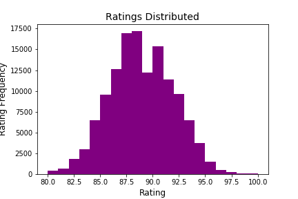

# wine_ratings

    

## Motivation
As a self-proclaimed Oenophile, analyzing the data collected by wine experts employed by WineEnthusist, allowed me to dive into the controversial subject of wine ratings. Ratings help guide consumers to spend their money on wine that has verified, quantified quality. This key advertising strategy has launched a series of tasting events, social media rating apps along with wine competitions. Wine consumption has been skyrocketing, and as such, exploring our built in assumptions is a key aspect to moving forward in the wine industry. 

## Questions
1. Do our tasters have a more lengthy description of the wines they have rated higher? 
2. Do specific regions or countries have statistically higher ratings?

## About this Data
* Viewing this data before manipulating the points of interest, it seems like there is a total of thirteen categories. Of these thirteen, the following 5 columns provide the most interets. 
    1. Country: This gives the full name of the Country where the wine was made.
    2. description: Here is the description given by the wine taster
    3. points: This refers to the rating given by the taster
    4. price: Price of wine at the moment it was tasted
    5. province: states, divisons or other special areas within a country where winery is located
    6. taster_name: Name of the taster, info about the individual can be found on WineEnthusiast.com
    7. taster_twitter_handle: taster's available social media
    8. variety: what variety or type classifies the wine

* With 43 different countries listed, I was interested in the amount of wines from each country were rated in this data set. Here is a visual of the top included countries and the least included. 

* Price seems to drive much of the wine business. Viewing the inital disribution of prices, most wines tasted were between $10 and $70. However, these tasters have also ventured into the outlandish prices including the most exensive bottle: $330,000. 

    * In the visual above we see the prices with the top five countrys all have substatial outliers, the most sigificant being France. 
    * We also see an overall price drop when compared to the rating above, at and below the average point value of the data set. 

* The collection of ratings range from 80 to 100 which is a typical rating range for wines. In America, the ratings range from 80-100 and in Europe they range from 0 - 20. The ratings follow a bell curve shape centering around 88. 

Please check out my file, cleaning_justification.md for more information on how I determined which columns and rows to utilize for my questions. 

## Hypotheses
My first hypothesis was to determine in the region a wine was based had better ratings by our tasters. To investigate this I performed 4 separate hypothesis tests to make my final conclusion. The tests were determined one, on my personal preference of Italian wines, and two, on the popularity of the region. 

First hypothesis: Italain wines have higher ratings than other wines. 
Second hypothesis: Italian and French wines have variation in their ratings. 
Third hypothesis: Italian and Californian wines have variation in thier ratings. 
Fourt hhypothesis: Californian and French wines have variation in thier ratings.

Each of these hypotheses merit the use of the Mann Whitney U test. 
To determine superior ratings in my initial test, a single tailed test calculated a p-value of 0.001. 
When comparing the Italian and French wine ratings the p-value of 5.21e-23 shows a strong chance that the ratings  between these two regions have statistically significant difference. 
Similarly for the final two tests, Italian Wines compared to California wines calculated a p-value of 4.79e-09 and finally, French wines and California wines have a calculated p-value of 1.43e-07.

Each of these tests allow me to conclude that, yes, regions do have differences in ratings and that Italian wines have a statistically higher average rating than others.

Before you pick up a Tuscon Red for the weekend, the image below shows the cumulitive distribution functions for the regions in question. Although the p_values show a significant statistical difference, the practical difference between the ratings is minimal at best.

