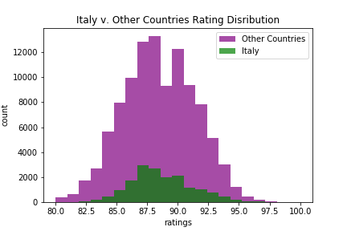

# wine_ratings 

## Motivation
As a self-proclaimed Oenophile, analyzing the data collected by wine experts employed by WineEnthusist, allowed me to dive into the controversial subject of wine ratings. Ratings help guide consumers to spend their money on wine that has verified, quantified quality. This key advertising strategy has launched a series of tasting events, social media rating apps along with wine competitions. Wine consumption has been skyrocketing, and as such, exploring our built in assumptions is a key aspect to moving forward in the wine industry. 

## About this Data
* Viewing this data before manipulating the points of interest, it seems like there is a total of thirteen categories. Of these thirteen, the following 5 columns provide the most interets. 
    1. country: This gives the full name of the Country where the wine was made.
    2. description: Here is the description given by the wine taster
    3. points: This refers to the rating given by the taster
    4. price: Price of wine at the moment it was tasted
    5. province: states, divisons or other special areas within a country where winery is located6

* With 43 different countries listed, the top included countries and the least included can be found in the image below. We see that US, Italy and France have the most available data per country. 

* Price seems to drive much of the wine business. Viewing the inital disribution of prices, most wines tasted were between $4 and $80. However, these tasters have also ventured into the outlandish prices including the most exensive bottle at $330,000. 

    * In the visual above we see the prices with the top five countrys all have substatial outliers, the most variation being in France. 
    * We also see an overall price drop when compared to the rating at or above, at and below the average point value of the data set. 

For more information about my data cleaning investigation, please check out my file, <a href = "https://github.com/hberginc/wine_ratings/blob/master/src/cleaning_justification.md">cleaning justifications</a> for more information.

## Hypotheses
Personally, I prefer Italian wines to any other region I have tried. Lets see if the ratings show off my own preference?  

1.  ### Italian Wine Compared to Other Countries
Italian wines have higher ratings when compared to other countries. 

 *The collection of ratings range from 80 to 100, which is a typical rating range for wines. Here we see very little differene in the two distributions visually.*

 * Setting a significance level of 0.05 and returning a p_value of 0.0008 determines that I am confident that the **Italian wines on average rate higher than the other countries wines** provided.

2. ### Three Way Comparison between Italy, France and California. 

    a. Italian wines have higher ratings when compared to France.

    b. Italian wines have higher ratings when compared to California.

    c. French Wines have higher ratings when compared to California. 

* Each of these hypotheses merit the use of the Mann Whitney U test all single tailed since I am looking for a clear 'best' characteristic of the regions ratings.

*A quick preview of the rating distributions shows very little difference in their overall popularity.* 

 * First and Second comparison showed no significant difference in the ratings between the Italian wines and the French wines. Due to the utilization of the Italy data in my previous hypothesis, I utilized the Bonferroni Correction to modify the inital p_values for each sample that was repeated. Gathering a p_value of 1 for both tests comparing Italy, showing no confidence in a difference between the two. 
 * Surprisingly, there was a statistical difference with French and Californian wines. **French wines do have a greater average rating than Californian wines**, gathering a p_value of 1.429e-07. 

Before stocking up on Chablis, the image below shows the cumulitive distribution functions for the regions in question. The minimal differences in the slopes of each region does not highlight our statisticaltests findings. Investigating the slight variation in slope would note minor differences in our wine's point values. 

*Examining the slopes of these graphs compared to each region, we see very little change when determing the difference in points. Idenifying the incremental increase in the French wines, the slopes are steeper around 93 points than Italy, indicating more French wines accumulated that point value.* 

To truly investigate the weight of the statistical test, I bootstrapped means of each region of interest. The image below highlights those findings. 

*Taking a closer look at a bootstrapped mean distribution helps highlight the variances that our statistical tests caught onto. Note the x_axis is a range  of at most a half of a point value.*
    
Original Data:
* Italian points Avg: 88.56 with 19540 samples available
* French points Avg: 88.85 with 22,093 samples available
* California points Avg: 88.63 with 36,247 samples available. 

### **Although there is an obvious statistical difference in these wine ratings, note that the practical difference is too minimal to convince these tasters to stock up on their French varieties.**

## Further Interests
I find interest in studying this data deeper focusing on the obvious price differences in wines available. Noting the overpowering effect of the price outliers and the minimal range of a 20 point rating system I am wondering if higher priced wines would benefit from a more comprehensive rating system to highlight the differences between the 90 point $80 bottle and the 90 point $1000 bottle. 

## Resources
[Wine Reviews Kaggle Database](https://www.kaggle.com/zynicide/wine-reviews)

[WineEnthusiast E-Magazine](https://www.winemag.com/)

